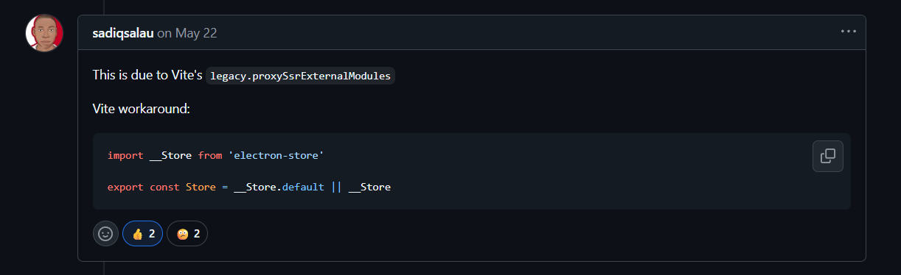

#### 开发问题和解决方案

###### 前端:


npm create @quick-start/electron frontend

​	配置axios请求、各种css、代理、端口


###### vite的electron-store主进程不可用 Store




###### css图标渲染问题

```css
.window-drag-bar {
  height: 25px;
  width: 100%;
  -webkit-app-region: drag;
  background: #111827 !important;
  color: #fff;
  display: flex;
  align-items: center;
  padding-left: 12px;
  user-select: none;
  margin: 0;
  padding: 0;
  overflow: hidden;
}
.window-controls {
  position: absolute;
  right: 16px;
  top: 0;
  height: 100%;
  display: flex;
  align-items: center;  /* 解决：line-height: 25px; 替代 align-items: center; */
  gap: 16px;
  -webkit-app-region: no-drag; /* 让按钮可点击 */
  color: white;
}
.window-controls .iconfont {
  font-size: 16px;
  color: #bbb;
  cursor: pointer;
  transition: color 0.2s;
}
```

问题所在：

1. padding: 0 覆盖了 padding-left: 12px

2. align-items: center 在高度只有 25px 的情况下，可能导致图标被裁剪或定位异常

最大化问题：

```ts
case 0:
  const display = screen.getDisplayMatching(win.getBounds())
  const { width: screenWidth, height: screenHeight } = display.workArea
  console.log(win?.getSize())
  console.log(screenWidth + ' ' + screenHeight)
  if (win?.getSize() === [screenWidth, screenHeight] as number[]){
    win?.unmaximize()
  } else {
    win?.maximize()
  }
  break

```

不能直接比对
DPI缩放（缩放比例）：Windows 下如果显示设置里缩放比例不是100%，Electron 的 getSize() 返回的是物理像素，而 screen 的 workArea 可能是逻辑像素。
窗口边框/阴影：有些系统窗口最大化时会有1像素的边框或阴影，导致 getSize() 比 workArea 大。

应该直接调api:

```ts
case 0:
  if (win?.isMaximized()){
    win?.unmaximize()
  } else {
    win?.maximize()
  }
  break
```


##### 后端:

###### [Netty,接收到一个请求，但是代码段执行了两次，为什么？-CSDN社区](https://bbs.csdn.net/topics/392009713)

这是HttpRequestDecoder把请求拆分成 HttpRequest 和 HttpContent 两部分了， 要这样 

pipeline.addLast("decoder",new HttpRequestDecoder()); 

//把 ByteBuf 解码到 HttpRequest/HttpRespone 和 HttpContent、LastHttpContent 

pipeline.addLast("encoder", new HttpResponseEncoder()); 

pipeline.addLast("aggregator", new HttpObjectAggregator(1024*1024*64));

// 将 解码到的多个http消息合成一个FullHttpRequest/FullHttpRespone 然后在Handler里,就只接收到一个FullHttpRequest了 if (msg instanceof FullHttpRequest) { ... }


###### 字段 content_hash 低成本实现数据库完整性


###### 如果我要设计消息点赞和点踩的需求，是在im_conversation里加字段，还是新建一个表

在即时通讯系统中添加消息点赞/点踩功能时，**必须使用独立的关系型数据表**，而不是在会话表或消息表中添加字段

1. **数据范式违背**

   - 会话表存储的是会话元数据，与具体消息的互动行为无关
   - 违反数据库第三范式（3NF），导致数据冗余

2. **性能灾难**

   ```sql
   -- 错误示例：在会话表添加点赞字段
   ALTER TABLE im_conversation ADD COLUMN like_count INT DEFAULT 0;
   ```

   - 热门消息会导致会话表行锁竞争（如10万用户点赞同一消息）
   - 更新冲突：`UPDATE ... SET like_count = like_count + 1` 引发锁等待

3. **扩展性限制**

   - 无法记录具体点赞用户
   - 无法区分点赞/点踩类型
   - 无法支持撤回点赞等操作


###### 文本消息避免分区

```mysql
create table im_message_text (
    message_id bigint unsigned not null primary key comment '关联消息id',
    content text not null comment '消息内容（加密存储SHA-3）',
    content_hash char(32) comment '内容哈希值（防篡改）',
    at_user_ids json comment '@的用户id列表',
    format_version tinyint default 1 comment '内容格式版本',
    -- 全文索引（支持中文搜索）
    fulltext index idx_content_fulltext (content) with parser ngram
) collate = utf8mb4_general_ci, engine = innodb, row_format = compressed, key_block_size = 8
comment '文本消息内容'
partition by hash(message_id % 64) partitions 64;
报错 [HY000][1214] The used table type doesn't support FULLTEXT indexes
```


#### 开发思路和关键设计


先写后端的 netty 部分 -> 登录部分业务 -> 前端搭建 -> 联系人业务 -> 群组业务 -> Ai机器人


###### 数据库设计关键点：

- 改名机制(改名上限、重放机制)
- 封号处理
- ip 属地处理


###### 业务设计关键点：

发送失败和本地数据库


消息可靠性(信箱机制、ack入库出库、重试机制)


消息时序性(前端发送带上时间戳)


多端同步(收信箱级别递增)


关系管理(单聊[拉黑、好友、特别好友、无状态]、多聊[群组、管理员、多聊黑名单])

（冷热分离）


消息类型(文本+emoji、表情、文件[语音信息]、红包、视频聊天、语音聊天、位置信息)


消息状态(发送中、已发送、未读、已读数目、点赞数目)

会话状态(特别关注、未读数目[上限99+条]、消息排序、room_id和create_time联合索引)


发红包、拆红包、过期红包退款


点赞系统(分布式锁)


发送控制


信息压缩


重连接机制

