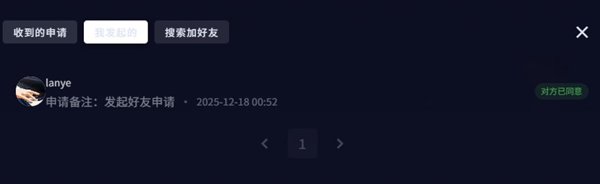

# TellYou 项目核心目录树

## Backend

### backend/modules
```
modules/
├── src/main/java/org/com/modules/
│   ├── common/                    # 通用模块
│   │   ├── annotation/           # 注解
│   │   ├── aspect/                # AOP切面
│   │   ├── config/                # 配置类
│   │   ├── domain/                # 通用领域对象
│   │   ├── exception/             # 异常处理
│   │   ├── interceptor/           # 拦截器
│   │   ├── service/               # 通用服务
│   │   │   ├── flow/              # 流控服务
│   │   │   └── lock/              # 锁服务
│   │   └── util/                  # 工具类
│   │
│   ├── contact/                   # 联系人模块
│   │   ├── controller/            # 控制器
│   │   ├── dao/                   # 数据访问层
│   │   │   ├── mongodb/           # MongoDB DAO
│   │   │   └── mysql/             # MySQL DAO
│   │   ├── domain/                # 领域对象
│   │   │   ├── document/          # MongoDB文档
│   │   │   ├── entity/            # 实体类
│   │   │   ├── enums/             # 枚举
│   │   │   └── vo/                # 视图对象
│   │   ├── mapper/                # MyBatis Mapper
│   │   └── service/               # 服务层
│   │       ├── adapter/           # 适配器
│   │       └── impl/              # 服务实现
│   │
│   ├── deliver/                   # 消息投递模块
│   │   ├── config/                # 配置
│   │   ├── domain/                # 领域对象
│   │   │   ├── enums/             # 枚举
│   │   │   └── vo/push/           # 推送视图对象
│   │   ├── event/                 # 事件
│   │   │   └── listener/          # 事件监听器
│   │   └── service/               # 服务层
│   │       ├── dispatch/          # 分发服务
│   │       └── retry/             # 重试服务
│   │
│   ├── group/                     # 群组模块
│   │
│   ├── mail/                      # 消息模块
│   │   ├── cache/                 # 缓存
│   │   ├── consumer/              # 消费者
│   │   ├── controller/            # 控制器
│   │   ├── dao/                   # 数据访问层
│   │   ├── domain/                # 领域对象
│   │   │   ├── document/          # MongoDB文档
│   │   │   ├── dto/               # 数据传输对象
│   │   │   ├── entity/            # 实体类
│   │   │   ├── enums/             # 枚举
│   │   │   └── vo/                # 视图对象
│   │   ├── mapper/                # MyBatis Mapper
│   │   ├── producer/              # 生产者
│   │   └── service/               # 服务层
│   │       └── impl/              # 服务实现
│   │
│   ├── media/                     # 媒体模块
│   │
│   └── user/                      # 用户模块
│       ├── controller/            # 控制器
│       ├── dao/                   # 数据访问层
│       ├── domain/                # 领域对象
│       │   ├── entity/            # 实体类
│       │   └── vo/                # 视图对象
│       ├── mapper/                # MyBatis Mapper
│       └── service/               # 服务层
│           ├── adapter/           # 适配器
│           └── impl/              # 服务实现
│
└── src/main/resources/
    ├── avatar/                    # 头像资源
    └── mapper/                    # MyBatis XML映射文件
```

### backend/starter
```
starter/
├── src/main/java/org/com/starter/
│   ├── netty/                     # Netty启动器
│   │   ├── handler/               # 处理器
│   │   ├── properties/            # 配置属性
│   │   └── NettyStarter.java
│   ├── NettyStarterApplication.java
│   └── StarterApplication.java
│
└── src/main/resources/
    ├── application.yml            # 应用配置
    ├── file.conf                  # 文件配置
    └── static/                    # 静态资源
```

### backend/tools
```
tools/
└── src/main/java/org/com/tools/
    ├── constant/                  # 常量定义
    ├── exception/                 # 异常定义
    ├── properties/                # 配置属性
    ├── template/                  # 模板类
    │   └── domain/                # 领域对象
    └── utils/                     # 工具类
```

## Frontend

### frontend/src
```
src/
├── main/                          # 主进程
│   ├── cache/                     # 缓存管理
│   ├── electron-store/            # Electron存储
│   │   └── persist/               # 持久化存储
│   ├── service/                   # 服务层
│   ├── sqlite/                    # SQLite数据库
│   │   ├── adapter/               # 适配器
│   │   ├── dao/                   # 数据访问对象
│   │   └── table.ts               # 表定义
│   ├── util/                      # 工具类
│   ├── websocket/                 # WebSocket客户端
│   └── index.ts                   # 入口文件
│
├── preload/                       # 预加载脚本
│   └── index.ts
│
├── renderer/                      # 渲染进程
│   └── src/
│       ├── assets/                # 静态资源
│       │   ├── font-alibaba/      # 字体
│       │   ├── group/              # 群组资源
│       │   ├── icon/               # 图标
│       │   └── img/                # 图片
│       │
│       ├── components/            # 组件
│       │
│       ├── router/                # 路由
│       │
│       ├── status/                # 状态管理
│       │   ├── application/       # 应用状态
│       │   ├── black/             # 黑名单状态
│       │   ├── media/             # 媒体状态
│       │   ├── message/           # 消息状态
│       │   ├── profile/           # 用户资料状态
│       │   └── session/           # 会话状态
│       │
│       ├── utils/                 # 工具函数
│       │
│       └── views/                 # 视图页面
│           ├── account/           # 账户相关
│           ├── chat/              # 聊天相关
│           │   ├── group/         # 群组
│           │   ├── left/          # 左侧面板
│           │   │   ├── message/   # 消息组件
│           │   │   └── send/      # 发送组件
│           │   └── right/         # 右侧面板
│           │       └── contact/   # 联系人
│           ├── relation/          # 关系管理
│           │   ├── apply/         # 申请相关
│           │   ├── black/         # 黑名单
│           │   └── group/         # 群组管理
│           └── setting/           # 设置
│
└── shared/                        # 共享资源
    ├── resources/                 # 资源文件
    │   ├── file-preview/          # 文件预览图标
    │   └── software/               # 软件资源
    └── types/                     # 类型定义
```


### 简单演示





