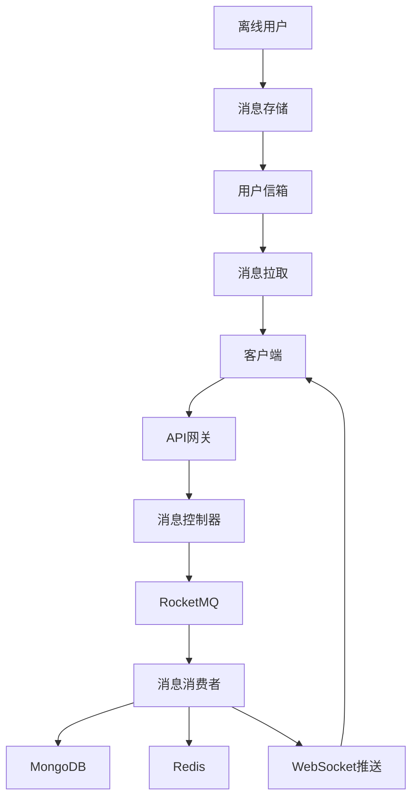

# TellYou IM系统消息流转设计

## 消息流转架构

### 整体架构图



## 消息发送流程

### 1. 客户端发送消息

```javascript
// 客户端发送消息
const message = {
    toUserId: 123456789,
    messageType: 1, // 文本消息
    content: "Hello World",
    clientMessageId: "client_msg_001",
    clientTimestamp: Date.now()
};

// 发送到服务器
websocket.send(JSON.stringify(message));
```

### 2. 服务端接收处理

```java
@MessageMapping("/send")
public void handleMessage(MessageReq messageReq, SimpMessageHeaderAccessor headerAccessor) {
    // 1. 参数验证
    validateMessage(messageReq);
    
    // 2. 用户认证
    Long userId = getCurrentUserId(headerAccessor);
    messageReq.setFromUid(userId);
    
    // 3. 发送到消息队列
    messageProducer.sendMessage(messageReq);
    
    // 4. 返回ACK给发送者
    sendAckToSender(userId, messageReq.getClientMessageId());
}
```

### 3. 消息队列处理

```java
@Service
public class MessageProducer {
    
    public void sendMessage(MessageReq messageReq) {
        // 发送到RocketMQ
        String message = JSON.toJSONString(messageReq);
        rocketMQTemplate.convertAndSend(MQConstant.SESSION_TOPIC, message);
    }
}
```

### 4. 消息消费处理

```java
@RocketMQMessageListener(
    topic = MQConstant.SESSION_TOPIC,
    consumerGroup = MQConstant.SESSION_GROUP
)
public class SessionConsumer implements RocketMQListener<String> {
    
    @Override
    public void onMessage(String message) {
        MessageReq req = JSON.parseObject(message, MessageReq.class);
        
        // 1. 构建消息文档
        MessageDoc messageDoc = messageAdapter.buildMessage(req);
        
        // 2. 获取接收者列表
        List<Long> uidList = getUidList(req);
        
        // 3. 保存消息到MongoDB
        chatService.save(messageDoc, uidList);
        
        // 4. 发布消息发送事件
        applicationEventPublisher.publishEvent(
            new MessageSendEvent(this, messageDoc, uidList)
        );
    }
}
```

## 消息存储机制

### 1. 消息内容存储

```java
// 消息内容存储在MongoDB
@Document(collection = "message_content")
public class MessageDoc {
    @Id
    private String messageId;           // 消息唯一ID
    private Long sessionId;             // 会话ID
    private Long sequenceNumber;        // 会话内序列号
    private String clientMessageId;     // 客户端消息ID
    private Integer messageType;        // 消息类型
    private Long senderId;              // 发送者ID
    private String content;             // 消息内容
    private Long clientTimestamp;       // 客户端时间戳
    private String adjustedTimestamp;   // 调整后时间戳
    private Boolean isRecalled;         // 是否撤回
    private Integer status;             // 消息状态
    private Long createTime;            // 创建时间
    private Long updateTime;            // 更新时间
    private Object extJson;             // 扩展信息
}
```

### 2. 用户信箱机制

```java
// 用户信箱存储在MongoDB
@Document(collection = "user_inbox")
public class UserInBoxDoc {
    @Id
    private String id;
    private Long userId;                // 用户ID
    private Long sessionId;             // 会话ID
    private String messageId;           // 消息ID
    private Integer status;             // 消息状态：0-未读 1-已读 2-已确认
    private Long readTime;              // 阅读时间
    private Long ackTime;               // 确认时间
    private Long createTime;            // 创建时间
    private Long updateTime;            // 更新时间
}
```

### 3. 消息保存逻辑

```java
@Service
public class ChatServiceImpl implements ChatService {
    
    public void save(MessageDoc messageDoc, List<Long> uidList) {
        // 1. 保存消息内容
        messageDocDao.save(messageDoc);
        
        // 2. 为每个用户创建信箱记录
        for (Long uid : uidList) {
            UserInBoxDoc inboxDoc = UserInBoxDoc.builder()
                .userId(uid)
                .sessionId(messageDoc.getSessionId())
                .messageId(messageDoc.getMessageId())
                .status(0) // 未读状态
                .createTime(System.currentTimeMillis())
                .build();
            
            userInBoxDocDao.save(inboxDoc);
        }
    }
}
```

## 消息推送机制

### 1. 在线用户推送

```java
@Component
public class MessageSendEventListener {
    
    @EventListener
    @Async
    public void handleMessageSendEvent(MessageSendEvent event) {
        MessageDoc messageDoc = event.getMessageDoc();
        List<Long> uidList = event.getUidList();
        
        // 1. 检查用户在线状态
        for (Long uid : uidList) {
            if (isUserOnline(uid)) {
                // 2. 推送给在线用户
                pushMessageToUser(uid, messageDoc);
            } else {
                // 3. 离线用户消息已存储在信箱中
                log.info("用户{}离线，消息已存储到信箱", uid);
            }
        }
    }
    
    private void pushMessageToUser(Long userId, MessageDoc messageDoc) {
        // 通过WebSocket推送消息
        String destination = "/user/" + userId + "/queue/message";
        MessageVo messageVo = messageAdapter.buildMessageVo(messageDoc);
        
        messagingTemplate.convertAndSend(destination, messageVo);
    }
}
```

### 2. WebSocket连接管理

```java
@Component
public class WebSocketHandler extends TextWebSocketHandler {
    
    private final Map<Long, Set<WebSocketSession>> userSessions = new ConcurrentHashMap<>();
    
    @Override
    public void afterConnectionEstablished(WebSocketSession session) {
        Long userId = getUserIdFromSession(session);
        
        // 添加用户会话
        userSessions.computeIfAbsent(userId, k -> ConcurrentHashMap.newKeySet())
                   .add(session);
        
        // 更新用户在线状态
        updateUserOnlineStatus(userId, true);
        
        log.info("用户{}建立WebSocket连接", userId);
    }
    
    @Override
    public void afterConnectionClosed(WebSocketSession session, CloseStatus status) {
        Long userId = getUserIdFromSession(session);
        
        // 移除用户会话
        Set<WebSocketSession> sessions = userSessions.get(userId);
        if (sessions != null) {
            sessions.remove(session);
            if (sessions.isEmpty()) {
                userSessions.remove(userId);
                // 更新用户离线状态
                updateUserOnlineStatus(userId, false);
            }
        }
        
        log.info("用户{}断开WebSocket连接", userId);
    }
}
```

## 消息确认机制

### 1. ACK确认流程

```java
// 客户端发送ACK确认
const ackMessage = {
    messageId: "server_msg_001",
    sessionId: 123456789,
    ackType: "received" // received, read
};

websocket.send(JSON.stringify(ackMessage));
```

### 2. 服务端ACK处理

```java
@MessageMapping("/ack")
public void handleAck(AckReq ackReq, SimpMessageHeaderAccessor headerAccessor) {
    Long userId = getCurrentUserId(headerAccessor);
    
    // 1. 更新用户信箱状态
    userInBoxDocDao.updateAckStatus(
        userId, 
        ackReq.getSessionId(), 
        ackReq.getMessageId(), 
        ackReq.getAckType()
    );
    
    // 2. 发送ACK确认到消息队列
    AckMessage ackMessage = AckMessage.builder()
        .userId(userId)
        .sessionId(ackReq.getSessionId())
        .messageId(ackReq.getMessageId())
        .ackType(ackReq.getAckType())
        .ackTime(System.currentTimeMillis())
        .build();
    
    ackProducer.sendAck(ackMessage);
}
```

### 3. ACK生命周期管理

```java
@RocketMQMessageListener(
    topic = MQConstant.ACK_TOPIC,
    consumerGroup = MQConstant.ACK_MANAGER_GROUP
)
public class AckCycleConsumer implements RocketMQListener<String> {
    
    @Override
    public void onMessage(String message) {
        AckMessage ackMessage = JSON.parseObject(message, AckMessage.class);
        
        // 1. 处理ACK确认
        processAck(ackMessage);
        
        // 2. 检查未确认消息
        checkUnacknowledgedMessages(ackMessage.getUserId());
    }
    
    private void checkUnacknowledgedMessages(Long userId) {
        // 查找未确认的消息
        List<UserInBoxDoc> unackMessages = userInBoxDocDao.findUnacknowledgedMessages(userId);
        
        for (UserInBoxDoc inboxDoc : unackMessages) {
            // 检查消息是否超时
            if (isMessageTimeout(inboxDoc)) {
                // 重新推送消息
                resendMessage(userId, inboxDoc);
            }
        }
    }
}
```

## 离线消息处理

### 1. 离线消息存储

```java
// 离线消息自动存储到用户信箱
@Service
public class OfflineMessageService {
    
    public void storeOfflineMessage(MessageDoc messageDoc, Long userId) {
        UserInBoxDoc inboxDoc = UserInBoxDoc.builder()
            .userId(userId)
            .sessionId(messageDoc.getSessionId())
            .messageId(messageDoc.getMessageId())
            .status(0) // 未读状态
            .createTime(System.currentTimeMillis())
            .build();
        
        userInBoxDocDao.save(inboxDoc);
        
        // 更新用户未读消息数量
        updateUnreadCount(userId, messageDoc.getSessionId());
    }
}
```

### 2. 离线消息拉取

```java
@RestController
@RequestMapping("/message")
public class MessageController {
    
    @GetMapping("/pull")
    public ApiResult<List<MessageVo>> pullOfflineMessages(
            @RequestParam Long sessionId,
            @RequestParam(defaultValue = "0") Long lastMessageId,
            @RequestParam(defaultValue = "20") Integer size) {
        
        Long userId = getCurrentUserId();
        
        // 1. 拉取离线消息
        List<MessageDoc> messages = messageService.pullOfflineMessages(
            userId, sessionId, lastMessageId, size);
        
        // 2. 转换为VO
        List<MessageVo> messageVos = messages.stream()
            .map(messageAdapter::buildMessageVo)
            .collect(Collectors.toList());
        
        // 3. 更新消息状态为已读
        messageService.markMessagesAsRead(userId, sessionId, messages);
        
        return ApiResult.success(messageVos);
    }
}
```

## 消息时序性保证

### 1. 时间戳调整机制

```java
@Service
public class TimestampAdjuster {
    
    public String adjustTimestamp(Long clientTimestamp, Long serverTimestamp) {
        // 计算时间差
        long timeDiff = serverTimestamp - clientTimestamp;
        
        // 如果客户端时间偏差过大，使用服务器时间
        if (Math.abs(timeDiff) > MAX_TIME_DIFF) {
            return String.valueOf(serverTimestamp);
        }
        
        // 否则使用客户端时间
        return String.valueOf(clientTimestamp);
    }
}
```

### 2. 消息排序

```java
// 消息按时间戳排序
public List<MessageDoc> getMessagesBySession(Long sessionId, int page, int size) {
    Query query = new Query(Criteria.where("sessionId").is(sessionId))
        .with(Sort.by(Sort.Direction.ASC, "adjustedTimestamp"))
        .skip((page - 1) * size)
        .limit(size);
    
    return mongoTemplate.find(query, MessageDoc.class);
}
```

## 消息可靠性保证

### 1. 消息重试机制

```java
@Component
public class MessageRetryService {
    
    @Retryable(value = Exception.class, maxAttempts = 3)
    public void sendMessage(MessageDoc messageDoc, Long userId) {
        try {
            // 发送消息
            pushMessageToUser(userId, messageDoc);
        } catch (Exception e) {
            log.error("消息发送失败，准备重试", e);
            throw e;
        }
    }
    
    @Recover
    public void recover(Exception ex, MessageDoc messageDoc, Long userId) {
        log.error("消息发送重试失败，消息ID: {}", messageDoc.getMessageId(), ex);
        
        // 将消息加入死信队列
        deadLetterQueue.add(messageDoc, userId);
    }
}
```

### 2. 消息幂等性

```java
@Service
public class MessageIdempotentService {
    
    public boolean isDuplicateMessage(String clientMessageId, Long userId) {
        String key = "message:idempotent:" + userId + ":" + clientMessageId;
        
        // 检查Redis中是否存在
        Boolean exists = redisTemplate.hasKey(key);
        if (exists) {
            return true;
        }
        
        // 设置过期时间
        redisTemplate.opsForValue().set(key, "1", Duration.ofHours(24));
        return false;
    }
}
```

## 性能优化

### 1. 消息批量处理

```java
@Service
public class BatchMessageService {
    
    @Async
    public void batchProcessMessages(List<MessageDoc> messages) {
        // 批量保存消息
        messageDocDao.saveAll(messages);
        
        // 批量创建信箱记录
        List<UserInBoxDoc> inboxDocs = new ArrayList<>();
        for (MessageDoc message : messages) {
            for (Long userId : getMessageRecipients(message)) {
                UserInBoxDoc inboxDoc = UserInBoxDoc.builder()
                    .userId(userId)
                    .sessionId(message.getSessionId())
                    .messageId(message.getMessageId())
                    .status(0)
                    .createTime(System.currentTimeMillis())
                    .build();
                inboxDocs.add(inboxDoc);
            }
        }
        userInBoxDocDao.saveAll(inboxDocs);
    }
}
```

### 2. 消息压缩

```java
@Service
public class MessageCompressionService {
    
    public String compressMessage(String message) {
        if (message.length() > COMPRESSION_THRESHOLD) {
            return Base64.getEncoder().encodeToString(
                CompressionUtils.compress(message.getBytes())
            );
        }
        return message;
    }
    
    public String decompressMessage(String compressedMessage) {
        try {
            byte[] decompressed = CompressionUtils.decompress(
                Base64.getDecoder().decode(compressedMessage)
            );
            return new String(decompressed);
        } catch (Exception e) {
            return compressedMessage; // 返回原消息
        }
    }
}
```

## 监控与告警

### 1. 消息处理监控

```java
@Component
public class MessageMetrics {
    
    private final MeterRegistry meterRegistry;
    private final Counter messageSentCounter;
    private final Timer messageProcessingTimer;
    
    public MessageMetrics(MeterRegistry meterRegistry) {
        this.meterRegistry = meterRegistry;
        this.messageSentCounter = Counter.builder("messages.sent")
            .description("Total messages sent")
            .register(meterRegistry);
        this.messageProcessingTimer = Timer.builder("messages.processing.time")
            .description("Message processing time")
            .register(meterRegistry);
    }
    
    public void recordMessageSent() {
        messageSentCounter.increment();
    }
    
    public void recordProcessingTime(Duration duration) {
        messageProcessingTimer.record(duration);
    }
}
```

### 2. 告警配置

```yaml
# alertmanager.yml
groups:
  - name: message_alerts
    rules:
      - alert: MessageProcessingDelay
        expr: rate(messages_processing_time_seconds[5m]) > 0.1
        for: 2m
        labels:
          severity: warning
        annotations:
          summary: "消息处理延迟过高"
          description: "消息处理延迟超过阈值"
      
      - alert: MessageQueueBacklog
        expr: rocketmq_consumer_lag > 1000
        for: 1m
        labels:
          severity: critical
        annotations:
          summary: "消息队列积压严重"
          description: "消息队列积压超过1000条"
```

