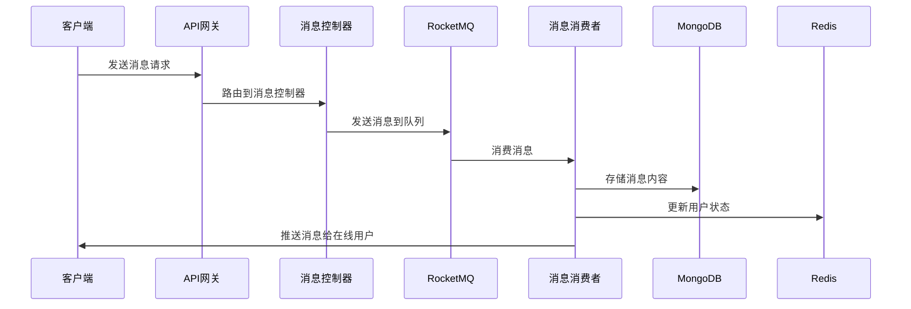

# TellYou IM系统架构设计

## 系统架构概览

TellYou IM系统采用分层架构设计，主要包含以下层次：

```
┌─────────────────────────────────────────────────────────────┐
│                    客户端层 (Frontend)                        │
├─────────────────────────────────────────────────────────────┤
│                    API网关层 (Gateway)                       │
├─────────────────────────────────────────────────────────────┤
│                    应用服务层 (Application)                   │
│  ┌─────────────┐  ┌─────────────┐  ┌─────────────┐          │
│  │  用户模块   │  │  会话模块   │  │  消息模块   │          │
│  └─────────────┘  └─────────────┘  └─────────────┘          │
├─────────────────────────────────────────────────────────────┤
│                    基础设施层 (Infrastructure)                │
│  ┌─────────────┐  ┌─────────────┐  ┌─────────────┐          │
│  │   MySQL     │  │  MongoDB    │  │   Redis     │          │
│  └─────────────┘  └─────────────┘  └─────────────┘          │
└─────────────────────────────────────────────────────────────┘
```

## 核心模块设计

### 1. 用户管理模块 (User Module)

**职责**：
- 用户注册、登录、认证
- 用户信息管理（昵称、头像、签名等）
- 用户关系管理（好友、黑名单等）

**核心组件**：
- `UserInfoController`: 用户信息管理接口
- `AccountController`: 账号管理接口（登录、注册）
- `UserInfoService`: 用户业务逻辑服务
- `UserInfoDao`: 用户数据访问层

**数据存储**：
- MySQL: 用户基本信息、用户关系
- Redis: 登录状态、验证码缓存

### 2. 会话管理模块 (Session Module)

**职责**：
- 会话创建、管理、删除
- 群组管理（创建、加入、退出群组）
- 会话成员管理

**核心组件**：
- `GroupController`: 群组管理接口
- `GroupInfoService`: 群组信息服务
- `GroupContactService`: 群组联系人服务
- `SessionDao`: 会话数据访问层

**数据存储**：
- MySQL: 会话基本信息、群组信息
- MongoDB: 会话文档数据

### 3. 消息处理模块 (Message Module)

**职责**：
- 消息发送、接收、存储
- 消息确认机制（ACK）
- 离线消息处理
- 消息推送

**核心组件**：
- `MessageController`: 消息管理接口
- `SessionConsumer`: 消息消费者
- `AckCycleConsumer`: ACK确认消费者
- `ChatService`: 聊天服务
- `MessageAdapter`: 消息适配器

**数据存储**：
- MongoDB: 消息内容、用户信箱
- Redis: 在线用户状态、消息缓存

## 消息流转架构

### 消息发送流程



### 消息确认机制

系统采用"信箱机制"确保消息可靠投递：

1. **消息存储**: 消息内容存储在MongoDB的`message_content`集合中
2. **用户信箱**: 每个用户在每个会话中都有独立的信箱(`user_inbox`)
3. **ACK确认**: 客户端收到消息后发送ACK确认
4. **重试机制**: 未确认的消息会定时重试投递

## 数据存储设计

### MySQL数据库
- **用户表**: 存储用户基本信息
- **会话表**: 存储会话基本信息
- **群组表**: 存储群组信息
- **联系人表**: 存储用户关系信息

### MongoDB数据库
- **消息内容集合**: 存储所有消息的详细内容
- **用户信箱集合**: 存储用户在各会话中的消息状态
- **会话文档集合**: 存储会话的扩展信息

### Redis缓存
- **用户会话**: 存储用户登录状态
- **在线状态**: 存储用户在线信息
- **验证码**: 存储注册验证码
- **消息缓存**: 缓存热点消息数据

## 技术特性

### 1. 高可用性
- 分布式部署支持
- 消息队列保证消息不丢失
- 数据库主从复制

### 2. 高性能
- Netty异步网络通信
- Redis缓存加速
- MongoDB分片支持
- 消息批量处理

### 3. 可扩展性
- 微服务架构
- 水平扩展支持
- 模块化设计

### 4. 安全性
- JWT用户认证
- 接口限流控制
- 数据加密存储
- 权限控制

## 部署架构

### 开发环境
- 单机部署所有服务
- 使用Docker Compose管理依赖服务

### 生产环境
- 负载均衡器（Nginx）
- 应用服务器集群
- 数据库集群（主从复制）
- 缓存集群（Redis Cluster）
- 消息队列集群（RocketMQ Cluster）

## 监控与运维

### 日志管理
- 统一日志格式
- 日志分级记录
- 日志文件轮转

### 性能监控
- JVM监控
- 数据库性能监控
- 消息队列监控
- 接口响应时间监控

### 告警机制
- 系统异常告警
- 性能指标告警
- 业务异常告警

