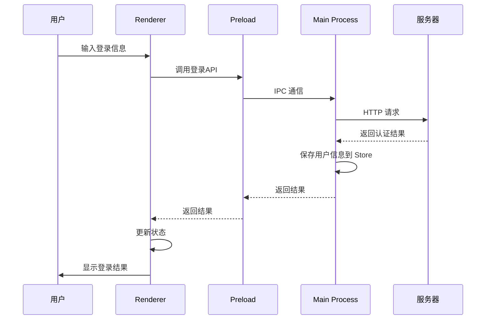
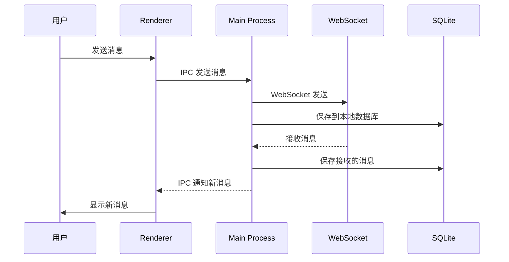

# 架构总览

## 系统架构

TellYou 采用经典的 Electron 三层架构设计：

```
┌─────────────────────────────────────────────────────────────┐
│                    用户界面层 (Renderer)                      │
│  ┌─────────────┐ ┌─────────────┐ ┌─────────────┐ ┌─────────┐ │
│  │   登录页面   │ │   聊天界面   │ │  联系人管理   │ │  设置   │ │
│  └─────────────┘ └─────────────┘ └─────────────┘ └─────────┘ │
│  ┌─────────────────────────────────────────────────────────┐ │
│  │              Vue 3 + TypeScript 前端框架                │ │
│  └─────────────────────────────────────────────────────────┘ │
└─────────────────────────────────────────────────────────────┘
                                │
                                │ IPC 通信
                                ▼
┌─────────────────────────────────────────────────────────────┐
│                    预加载层 (Preload)                        │
│  ┌─────────────────────────────────────────────────────────┐ │
│  │              安全桥接层 (Context Isolation)              │ │
│  └─────────────────────────────────────────────────────────┘ │
└─────────────────────────────────────────────────────────────┘
                                │
                                │ Node.js API
                                ▼
┌─────────────────────────────────────────────────────────────┐
│                    主进程层 (Main Process)                   │
│  ┌─────────────┐ ┌─────────────┐ ┌─────────────┐ ┌─────────┐ │
│  │  窗口管理    │ │  数据库服务   │ │  WebSocket   │ │  文件系统 │ │
│  └─────────────┘ └─────────────┘ └─────────────┘ └─────────┘ │
│  ┌─────────────────────────────────────────────────────────┐ │
│  │              Node.js + TypeScript 后端服务              │ │
│  └─────────────────────────────────────────────────────────┘ │
└─────────────────────────────────────────────────────────────┘
```

## 技术架构

### 前端架构 (Renderer Process)

```
src/renderer/src/
├── views/                    # 页面组件
│   ├── account/             # 用户认证页面
│   ├── chat/                # 聊天相关页面
│   ├── relation/            # 联系人管理页面
│   └── setting/             # 设置页面
├── components/              # 通用组件
│   ├── Avatar.vue          # 头像组件
│   ├── MediaUpload.vue     # 媒体上传组件
│   └── ...
├── status/                  # 状态管理 (Pinia)
│   ├── application/        # 应用状态
│   ├── message/            # 消息状态
│   ├── session/            # 会话状态
│   └── ...
├── router/                  # 路由配置
├── utils/                   # 工具函数
└── assets/                  # 静态资源
```

### 主进程架构 (Main Process)

```
src/main/
├── pull-service.ts                 # 主进程入口
├── sqlite/                  # 数据库层
│   ├── atom.ts             # 数据库连接
│   ├── table.ts            # 表结构定义
│   ├── adapter/            # 数据库适配器
│   └── dao/                # 数据访问对象
├── websocket/              # WebSocket 客户端
│   ├── client.ts           # WebSocket 连接
│   └── handler.ts          # 消息处理
├── service/                # 业务服务层
│   ├── media-service.ts    # 媒体处理服务
│   └── avatar-upload-service.ts
├── electron-store/         # 数据持久化
├── cache/                  # 缓存管理
└── ipc-center.ts          # IPC 通信中心
```

## 数据流架构

### 1. 用户认证流程



### 2. 消息收发流程



## 核心设计模式

### 1. MVC 模式

- **Model**: SQLite 数据库 + Pinia Store
- **View**: Vue 组件
- **Controller**: IPC 通信 + 服务层

### 2. DAO 模式

数据库访问采用 DAO (Data Access Object) 模式：

```typescript
// 示例：消息 DAO
export class MessageDAO {
  static async insertMessage(message: Message): Promise<boolean> {
    // 数据库插入逻辑
  }

  static async getMessagesBySessionId(sessionId: string): Promise<Message[]> {
    // 查询逻辑
  }
}
```

### 3. 观察者模式

使用 Pinia Store 实现状态管理：

```typescript
// 示例：消息状态管理
export const useMessageStore = defineStore('message', {
  state: () => ({
    messages: new Map<string, Message[]>(),
    currentSessionId: ''
  }),

  actions: {
    addMessage(message: Message) {
      // 添加消息逻辑
    }
  }
})
```

## 安全架构

### 1. 上下文隔离

- 主进程和渲染进程通过 IPC 安全通信
- 预加载脚本作为安全桥接层
- 禁用 Node.js 在渲染进程中的直接访问

### 2. 数据安全

- 敏感数据加密存储
- 用户数据本地化存储
- 安全的 WebSocket 连接

### 3. 文件访问控制

- 自定义协议 `tellyou://` 处理头像缓存
- 严格的路径验证和访问控制
- 防止目录遍历攻击

## 性能优化

### 1. 渲染优化

- Vue 3 Composition API 提供更好的性能
- 组件懒加载和代码分割
- 虚拟滚动处理大量消息

### 2. 内存管理

- 消息分页加载
- 图片缓存和压缩
- 定期清理过期数据

### 3. 网络优化

- WebSocket 长连接
- 消息批量发送
- 断线重连机制

## 扩展性设计

### 1. 模块化架构

- 按功能模块划分代码结构
- 松耦合的组件设计
- 可插拔的服务层

### 2. 配置化

- 环境变量配置
- 用户偏好设置
- 主题和样式定制

### 3. 插件系统

- 预留插件接口
- 支持功能扩展
- 第三方集成能力

## 部署架构

### 开发环境

```
开发机器
├── 前端开发服务器 (Vite Dev Server)
├── 后端 API 服务器
└── 数据库服务器
```

### 生产环境

```
用户机器
├── Electron 应用
├── SQLite 本地数据库
└── 远程 WebSocket 服务器
```

这种架构设计确保了应用的安全性、性能和可维护性，同时为未来的功能扩展提供了良好的基础。
