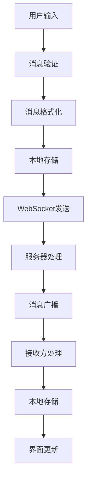

# 聊天功能

## 功能概述

TellYou 的聊天功能是应用的核心模块，提供了完整的即时通讯体验，包括实时消息收发、多媒体消息支持、消息历史记录等功能。

## 功能特性

### ✨ 核心功能
- **实时消息**: WebSocket 长连接实现即时通讯
- **多媒体消息**: 支持文本、图片、文件等多种消息类型
- **消息历史**: 本地 SQLite 数据库存储消息记录
- **会话管理**: 支持单聊、群聊等多种会话类型
- **消息状态**: 显示消息发送状态（发送中、已发送、已读等）

### 🎨 用户体验
- **消息气泡**: 美观的消息展示界面
- **时间显示**: 智能的时间分组显示
- **滚动定位**: 自动滚动到最新消息
- **输入提示**: 实时输入状态提示
- **表情支持**: 丰富的表情符号支持

## 技术架构

### 消息流程



### 数据模型

#### 消息实体 (Message)

```typescript
interface Message {
  id: string              // 消息唯一标识
  sessionId: string       // 会话ID
  senderId: string        // 发送者ID
  receiverId: string      // 接收者ID
  content: string         // 消息内容
  messageType: number     // 消息类型 (1:文本, 2:图片, 3:文件)
  timestamp: Date         // 发送时间
  status: number          // 消息状态 (0:发送中, 1:已发送, 2:已读)
  extra?: any            // 扩展信息
}
```

#### 会话实体 (Session)

```typescript
interface Session {
  sessionId: string       // 会话ID
  contactType: number     // 联系人类型 (1:好友, 2:群组)
  contactId: string       // 联系人ID
  lastMsgContent: string  // 最后一条消息内容
  lastMsgTime: Date       // 最后消息时间
  isPinned: boolean       // 是否置顶
  unreadCount: number     // 未读消息数
}
```

## 核心组件

### 1. 聊天主界面 (Chat.vue)

```vue
<template>
  <div class="chat-container">
    <!-- 聊天头部 -->
    <ChatHeader :session="currentSession" />
    
    <!-- 消息列表 -->
    <MessageList 
      :messages="messages" 
      :session-id="currentSessionId"
      @load-more="loadMoreMessages"
    />
    
    <!-- 消息输入框 -->
    <MessageSendBox 
      :session-id="currentSessionId"
      @send-message="handleSendMessage"
    />
  </div>
</template>
```

**主要功能**:
- 会话信息展示
- 消息列表渲染
- 消息输入处理
- 滚动控制

### 2. 消息列表 (MessageList)

```vue
<template>
  <div class="message-list" ref="messageListRef">
    <div v-for="message in messages" :key="message.id">
      <!-- 时间分隔符 -->
      <TimeMessage 
        v-if="shouldShowTime(message)" 
        :timestamp="message.timestamp" 
      />
      
      <!-- 消息气泡 -->
      <component 
        :is="getMessageComponent(message.messageType)"
        :message="message"
        :is-own="isOwnMessage(message)"
      />
    </div>
  </div>
</template>
```

**主要功能**:
- 消息渲染
- 时间分组
- 虚拟滚动
- 自动滚动

### 3. 消息输入框 (MessageSendBox)

```vue
<template>
  <div class="message-send-box">
    <!-- 工具栏 -->
    <div class="toolbar">
      <MediaUpload @upload="handleMediaUpload" />
      <EmojiPicker @select="handleEmojiSelect" />
    </div>
    
    <!-- 输入区域 -->
    <div class="input-area">
      <textarea 
        v-model="messageContent"
        @keydown="handleKeyDown"
        placeholder="输入消息..."
      />
      <button @click="sendMessage" :disabled="!canSend">
        发送
      </button>
    </div>
  </div>
</template>
```

**主要功能**:
- 文本输入
- 媒体上传
- 快捷键支持
- 输入验证

## 消息类型

### 1. 文本消息 (TextMessage.vue)

```vue
<template>
  <div class="text-message" :class="{ 'own': isOwn }">
    <div class="message-bubble">
      <div class="content">{{ message.content }}</div>
      <div class="time">{{ formatTime(message.timestamp) }}</div>
    </div>
  </div>
</template>
```

**特性**:
- 支持换行显示
- 链接自动识别
- 表情符号渲染
- 消息状态显示

### 2. 图片消息 (ImageMessage.vue)

```vue
<template>
  <div class="image-message" :class="{ 'own': isOwn }">
    <div class="message-bubble">
      
      <div class="time">{{ formatTime(message.timestamp) }}</div>
    </div>
  </div>
</template>
```

**特性**:
- 图片预览
- 懒加载
- 点击放大
- 加载状态

### 3. 文件消息 (FileMessage.vue)

```vue
<template>
  <div class="file-message" :class="{ 'own': isOwn }">
    <div class="message-bubble">
      <div class="file-info">
        <div class="file-icon">{{ getFileIcon(message.extra.fileType) }}</div>
        <div class="file-details">
          <div class="file-name">{{ message.extra.fileName }}</div>
          <div class="file-size">{{ formatFileSize(message.extra.fileSize) }}</div>
        </div>
        <button @click="downloadFile" class="download-btn">下载</button>
      </div>
      <div class="time">{{ formatTime(message.timestamp) }}</div>
    </div>
  </div>
</template>
```

**特性**:
- 文件信息展示
- 下载功能
- 文件类型图标
- 文件大小显示

## 状态管理

### 消息状态 (Message Store)

```typescript
// src/renderer/src/status/message/store.ts
export const useMessageStore = defineStore('message', {
  state: () => ({
    messages: new Map<string, Message[]>(),  // 按会话ID分组存储消息
    currentSessionId: '',                    // 当前会话ID
    loading: false,                          // 加载状态
    hasMore: true                           // 是否还有更多消息
  }),

  getters: {
    currentMessages: (state) => {
      return state.messages.get(state.currentSessionId) || []
    },
    
    unreadCount: (state) => {
      return Array.from(state.messages.values())
        .flat()
        .filter(msg => !msg.isRead).length
    }
  },

  actions: {
    // 添加消息
    async addMessage(message: Message) {
      const sessionMessages = this.messages.get(message.sessionId) || []
      sessionMessages.push(message)
      this.messages.set(message.sessionId, sessionMessages)
    },

    // 加载消息历史
    async loadMessages(sessionId: string, pageNo = 1, pageSize = 20) {
      this.loading = true
      try {
        const messages = await window.electronAPI.getMessagesBySessionId(
          sessionId, 
          { pageNo, pageSize }
        )
        
        const existingMessages = this.messages.get(sessionId) || []
        this.messages.set(sessionId, [...messages, ...existingMessages])
        
        this.hasMore = messages.length === pageSize
      } finally {
        this.loading = false
      }
    },

    // 发送消息
    async sendMessage(content: string, messageType: number, extra?: any) {
      const message: Message = {
        id: generateId(),
        sessionId: this.currentSessionId,
        senderId: getCurrentUserId(),
        content,
        messageType,
        timestamp: new Date(),
        status: 0, // 发送中
        extra
      }

      // 立即添加到本地
      await this.addMessage(message)

      // 通过 WebSocket 发送
      const success = await window.electronAPI.sendWebSocketMessage(message)
      
      if (success) {
        message.status = 1 // 已发送
      } else {
        message.status = -1 // 发送失败
      }

      return message
    }
  }
})
```

## WebSocket 通信

### 连接管理

```typescript
// src/main/websocket/client.ts
export class WebSocketClient {
  private ws: WebSocket | null = null
  private reconnectAttempts = 0
  private maxReconnectAttempts = 5

  async connect(url: string): Promise<void> {
    return new Promise((resolve, reject) => {
      this.ws = new WebSocket(url)
      
      this.ws.onopen = () => {
        console.log('WebSocket 连接已建立')
        this.reconnectAttempts = 0
        resolve()
      }
      
      this.ws.onmessage = (event) => {
        this.handleMessage(JSON.parse(event.data))
      }
      
      this.ws.onclose = () => {
        this.handleReconnect()
      }
      
      this.ws.onerror = (error) => {
        reject(error)
      }
    })
  }

  sendMessage(message: any): boolean {
    if (this.ws?.readyState === WebSocket.OPEN) {
      this.ws.send(JSON.stringify(message))
      return true
    }
    return false
  }

  private handleReconnect(): void {
    if (this.reconnectAttempts < this.maxReconnectAttempts) {
      this.reconnectAttempts++
      setTimeout(() => {
        this.connect(this.ws?.url || '')
      }, 1000 * this.reconnectAttempts)
    }
  }
}
```

### 消息处理

```typescript
// src/main/websocket/handler.ts
export class MessageHandler {
  static handleIncomingMessage(message: any): void {
    switch (message.type) {
      case 'CHAT_MESSAGE':
        this.handleChatMessage(message.data)
        break
      case 'MESSAGE_STATUS':
        this.handleMessageStatus(message.data)
        break
      case 'TYPING':
        this.handleTyping(message.data)
        break
    }
  }

  private static async handleChatMessage(data: any): Promise<void> {
    // 保存到本地数据库
    await MessageDAO.insertMessage(data)
    
    // 通知渲染进程
    const mainWindow = BrowserWindow.getFocusedWindow()
    if (mainWindow) {
      mainWindow.webContents.send('new-message', data)
    }
  }
}
```

## 数据库操作

### 消息 DAO

```typescript
// src/main/sqlite/dao/message-dao.ts
export class MessageDAO {
  static async insertMessage(message: Message): Promise<boolean> {
    const sql = `
      INSERT INTO messages (
        id, session_id, sender_id, receiver_id, 
        content, message_type, timestamp, status, extra
      ) VALUES (?, ?, ?, ?, ?, ?, ?, ?, ?)
    `
    
    try {
      await sqliteRun(sql, [
        message.id,
        message.sessionId,
        message.senderId,
        message.receiverId,
        message.content,
        message.messageType,
        message.timestamp.toISOString(),
        message.status,
        JSON.stringify(message.extra || {})
      ])
      return true
    } catch (error) {
      console.error('插入消息失败:', error)
      return false
    }
  }

  static async getMessagesBySessionId(
    sessionId: string, 
    options: { pageNo: number; pageSize: number }
  ): Promise<Message[]> {
    const sql = `
      SELECT * FROM messages 
      WHERE session_id = ? 
      ORDER BY timestamp DESC 
      LIMIT ? OFFSET ?
    `
    
    const offset = (options.pageNo - 1) * options.pageSize
    
    try {
      const rows = await queryAll(sql, [sessionId, options.pageSize, offset])
      return rows.map(this.mapRowToMessage)
    } catch (error) {
      console.error('查询消息失败:', error)
      return []
    }
  }

  private static mapRowToMessage(row: any): Message {
    return {
      id: row.id,
      sessionId: row.session_id,
      senderId: row.sender_id,
      receiverId: row.receiver_id,
      content: row.content,
      messageType: row.message_type,
      timestamp: new Date(row.timestamp),
      status: row.status,
      extra: row.extra ? JSON.parse(row.extra) : {}
    }
  }
}
```

## 性能优化

### 1. 虚拟滚动

对于大量消息的渲染，使用虚拟滚动技术：

```vue
<template>
  <div class="virtual-scroll-container" ref="containerRef">
    <div 
      class="virtual-scroll-content"
      :style="{ height: totalHeight + 'px' }"
    >
      <div 
        v-for="item in visibleItems" 
        :key="item.id"
        class="virtual-scroll-item"
        :style="{ transform: `translateY(${item.offset}px)` }"
      >
        <MessageComponent :message="item.data" />
      </div>
    </div>
  </div>
</template>
```

### 2. 消息分页加载

```typescript
// 分页加载消息
async loadMoreMessages(): Promise<void> {
  if (this.loading || !this.hasMore) return
  
  const currentPage = Math.ceil(this.messages.length / this.pageSize) + 1
  await this.messageStore.loadMessages(this.sessionId, currentPage, this.pageSize)
}
```

### 3. 图片懒加载

```vue
<template>
  
</template>

<script setup lang="ts">
const handleImageLoad = (event: Event) => {
  const img = event.target as HTMLImageElement
  const actualSrc = img.dataset.src
  
  if (actualSrc && isInViewport(img)) {
    img.src = actualSrc
  }
}
</script>
```

## 测试

### 单元测试

```typescript
// tests/message.test.ts
import { describe, it, expect } from 'vitest'
import { useMessageStore } from '@/status/message/store'

describe('Message Store', () => {
  it('should add message correctly', async () => {
    const store = useMessageStore()
    const message = {
      id: '1',
      sessionId: 'session1',
      content: 'Hello',
      messageType: 1,
      timestamp: new Date()
    }
    
    await store.addMessage(message)
    expect(store.currentMessages).toContain(message)
  })
})
```

### 集成测试

```typescript
// tests/chat-integration.test.ts
describe('Chat Integration', () => {
  it('should send and receive messages', async () => {
    // 模拟发送消息
    const message = await messageStore.sendMessage('Hello', 1)
    expect(message.status).toBe(1)
    
    // 模拟接收消息
    await messageHandler.handleIncomingMessage({
      type: 'CHAT_MESSAGE',
      data: message
    })
    
    expect(messageStore.currentMessages).toHaveLength(1)
  })
})
```

## 故障排除

### 常见问题

1. **消息发送失败**
   - 检查 WebSocket 连接状态
   - 验证网络连接
   - 查看控制台错误信息

2. **消息显示异常**
   - 检查消息数据格式
   - 验证组件渲染逻辑
   - 查看数据库存储状态

3. **性能问题**
   - 启用虚拟滚动
   - 优化图片加载
   - 减少不必要的重渲染

### 调试工具

```typescript
// 开发环境下的调试工具
if (process.env.NODE_ENV === 'development') {
  window.debugChat = {
    messageStore: useMessageStore(),
    sendTestMessage: () => messageStore.sendMessage('Test', 1),
    clearMessages: () => messageStore.clearMessages()
  }
}
```

---

聊天功能是 TellYou 应用的核心，通过合理的技术架构和优化策略，为用户提供了流畅的即时通讯体验。
